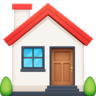

# TO-DO &nbsp;&nbsp;&nbsp;&nbsp;&nbsp;

___

# Audio

#### Normalization
- [ ] Normalize the volume of some dialogues and sound effects
    - [ ] ...

#### Synchronization
- [ ] Synchronize some dialogues and sound effects
    - [ ] ...

#### Dubbing
- [ ] Dub the NPC Robot Toy
    - [ ] ...

# Subtitle

#### Grammar
- [ ] Correct grammar error in some subtitles
    - [ ] ...

#### Intonation
- [ ] Emphasize the intonation of some phrases, adding more emotion to subtitles
    - [ ] ...

# Texture

#### Editing
- [ ] Edit the 50 ID Tags found during the game, transforming the pixelated image into a realistic image
    - [ ] ...